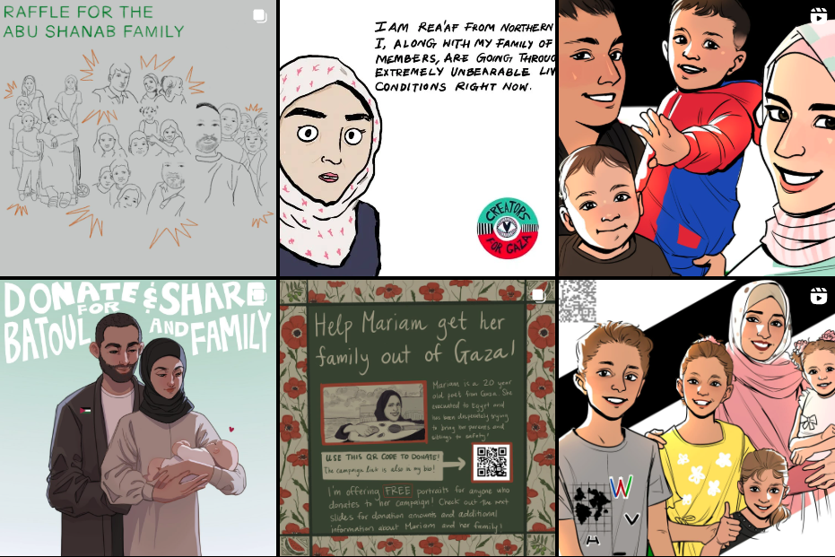

 

:::: {.card expandable="false"}
::: {style="background-color: #01e2b4; text-align: center; display: flex; align-items: center; justify-content: center; height: 100%;"}
[[CREATOR SIGN-UP](https://cryptpad.fr/form/#/2/form/view/8nuW2QzSR+5B0zlcKhMcJnGVnz-Ik+spwbSjYNyrmHc/)]{style="font-size: clamp(1.5rem, 3.5vw, 2.4rem); width: 100%; height: 300px"}
:::
::::

 

#### Sign up to create a support campaign for a family in Gaza!

By signing up to become a creator with us, you will be taking on one of our family campaigns and committing to **consistently** supporting and amplifying their campaign. You will be paired up with a family’s campaign, and put in touch with the contact for that campaign. You can do a social media- only offering, like a raffle, sale, auction or just beautiful content for the family. But you can also do in-person events like bake sales, benefit shows, markets, birthday party-fundraisers or offering services you already provide. **Your skillset and imagination are the limit. The aim is to bring attention to the campaign with something in a way that highlights that our Palestinian families in Gaza are not numbers. You can help our families feel seen and amplify their stories. We are seeking creators who can commit for the long haul, until our families’ needs are met.**

#### Can’t commit to being a creator?

**First, ask yourself why not?** We all make time for things that are important to us, and we have to fundraise because we have failed to stop The Genocide. If you cannot commit to becoming a creator, become an autonomous amplifier! Help support Creators and families on your own by printing and disseminating resources that have already been created.

-   Check out our [Instagram](https://www.instagram.com/creatorsforgaza/ "https://www.instagram.com/creatorsforgaza/"), and share our posts with your networks. Please include the direct links to the fundraisers. Tag us in your stories about our families!

-   Print out and [disseminate materials](https://drive.google.com/drive/folders/1DP0FoIJ5HYkfXWEFCutYxwSzBlqf1tGA "Resources folder") in your community. Take them to little free libraries, community bulletin boards, put inside birthday or greeting cards to friends and family, post them on telephone poles, ask local businesses if you can put one in their window.

-   Team up with some friends to organize a fundraising event, bake sale, garage sale, craft sale, whatever! Host a movie screening, and ask for donations! The possibilities are endless.

-   Text and / or email your friends and family about one of our family’s campaigns. This is a highly important and possibly the least utilized way of getting donations. People generally tend to support things that they know are personally meaningful to you.

-   Spread the word about Creators for Gaza! Encourage people to join us also! Encourage folks to share the posts about our families.

-   Sign up with recurring donations to one or multiple families, and encourage people you know to do the same. Even committing to donating just \$5 a week makes a difference, especially if we get people to join us. Most fundraising platforms have options to do this automatically so you don't even need to remember. If you have funds to go get a fun treat or a coffee each week, you have funds to support one of our families.

<!--   -->

<!--   -->

<!-- ::: {.card expandable="false"} -->

<!-- ::: {style="background-color: #01e2b4; color: black; text-align: center; display: flex; align-items: center; justify-content: center; height: 100%;"} -->

<!-- [[AMPLIFIER SIGN-UP](https://docs.google.com/forms/d/e/1FAIpQLSfwvxWeJ7V1FhzguYOP9lAkZ_SB8LogzT5e5pi_izvhm3mGQQ/viewform)]{style="font-size: clamp(1.5rem, 3.5vw, 2.4rem); width: 100%; height: 500px"} -->

<!-- ::: -->

<!-- ::: -->

<!-- *I want to share already created work* -->

 

[{fig-align="center"}](https://www.instagram.com/creatorsforgaza/)
